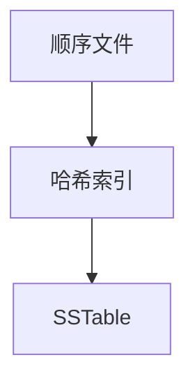
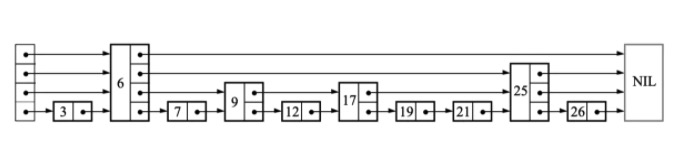

# 主线



# 顺序文件

## 最简单的存储
写数据：
``` shell
echo '${id}:${value}' >> data.txt
```
读数据：
``` shell
grep ${id} data.txt | awk -F ':' '{print $2}'
```

## 优缺点
1. 顺序写入文件，对磁盘io友好；
   > 操作系统中文件有页缓存，所以顺序写入文件速度比较快；
   > sata磁盘不用多说；
   > 提升ssd数据写入效率；
   >> page：最小的数据写入单元；
   >> block：由多个page组成，最小的数据擦除单元；
   >> 数据写入方式：读取原有page数据写入到缓存中&更新，然后再写入到一个新的page中 & 将原page置为无效。这样做的目的是方式热数据的频繁读写导致一个区域寿命耗尽；
2. 查询要全表扫描；

# 哈希索引

## hash map

### Bitcask
&nbsp;&nbsp;&nbsp;&nbsp;
Bitcask就是使用了这种方式，有两种文件：数据文件和索引文件。数据文件是顺序写入的，大大增加了数据写入的吞吐量。Bitcask会将key和value的位置以hash map的方式存在内存中，索引文件就是为了快速恢复这个索引内存的。在查询的时候，会先通过索引内存查找值的文件位置，然后再通过index获取真正的数据。

&nbsp;&nbsp;&nbsp;&nbsp;
索引内存写入磁盘，不必要实时可以定时写入。每次刷入磁盘记录一下当前的id，重启时可以通过上次写磁盘的id追溯新数据更新内存（数据是顺序写入的回溯也比较方便）。

### Redis
1. sds使用的是dict，采用hash散列方式存储；
2. dict有两个dictEntry，是用来做rehash的。rehash是通过每次增删改查来逐步迁移数据的（go的map是每次增改时迁移一条数据）；

## zskiplist

### 数据结构
```c
typedef struct zskiplistNode {
    sds ele;
    double score; // 值
    struct zskiplistNode *backward;
    struct zskiplistLevel {
        struct zskiplistNode *forward;
        unsigned long span; // 存储当前节点和当前级别的 node->forward 之间的节点数
    } level[]; // 跳表有多层，L层链接即L-1层也会被链接
} zskiplistNode;
```

### 插入数据
```c
zskiplistNode *zslInsert(zskiplist *zsl, double score, robj *obj) {
    // update记录每一层需要更新的节点（每一层对应的节点不一样）
    zskiplistNode *update[ZSKIPLIST_MAXLEVEL], *x;
    // rank记录每一层当前节点的排名
    unsigned int rank[ZSKIPLIST_MAXLEVEL];
    int i, level;

    serverAssert(!isnan(score));
    x = zsl->header;
    // 找到每一个level中最近的一个节点（上一个节点）
    // 从最上层开始找，这样下一层可以从上一层的节点为起点开始。能够更快
    for (i = zsl->level-1; i >= 0; i--) {
        rank[i] = i == (zsl->level-1) ? 0 : rank[i+1];
        while (x->level[i].forward &&
            (x->level[i].forward->score < score ||
                (x->level[i].forward->score == score && compareStringObjects(x->level[i].forward->obj,obj) < 0))) {
            // 记录每一层当前节点的排名（因为是先累加再指向下一个节点的指针，所以记录的是上一个节点的和）
            rank[i] += x->level[i].span;
            x = x->level[i].forward;
        }
        update[i] = x;
    }

    // 随机，这个新增的节点有几层Level
    level = zslRandomLevel();
    if (level > zsl->level) {
        for (i = zsl->level; i < level; i++) {
            rank[i] = 0;
            update[i] = zsl->header;
            update[i]->level[i].span = zsl->length;
        }
        zsl->level = level;
    }
    x = zslCreateNode(level,score,obj);
    for (i = 0; i < level; i++) {
        x->level[i].forward = update[i]->level[i].forward;
        update[i]->level[i].forward = x;
        // 中间插入新的节点，span重新计算（中间截断）
        x->level[i].span = update[i]->level[i].span - (rank[0] - rank[i]);
        update[i]->level[i].span = (rank[0] - rank[i]) + 1;
    }

    for (i = level; i < zsl->level; i++) {
        // 新增节点没够着的level，向前跳跃数+1（因为在这个节点的前面加了一个数据）
        update[i]->level[i].span++;
    }

    x->backward = (update[0] == zsl->header) ? NULL : update[0];
    if (x->level[0].forward)
        x->level[0].forward->backward = x;
    else
        zsl->tail = x;
    zsl->length++;
    return x;
}
```

# SSTable
