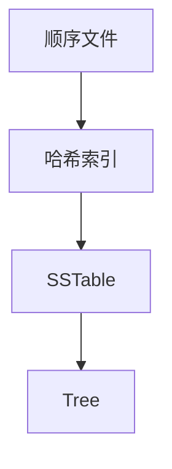
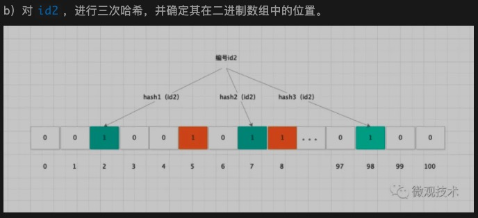
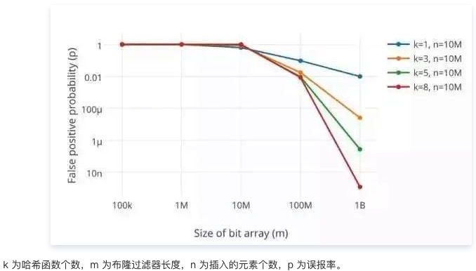

# 主线



# 顺序文件

## 最简单的存储
写数据：
``` shell
echo '${id}:${value}' >> data.txt
```
读数据：
``` shell
grep ${id} data.txt | awk -F ':' '{print $2}'
```

## 优缺点
1. 顺序写入文件，对磁盘io友好；
   > 操作系统中文件有页缓存，所以顺序写入文件速度比较快；
   > sata磁盘不用多说；
   > 提升ssd数据写入效率；
   >> page：最小的数据写入单元；
   >> block：由多个page组成，最小的数据擦除单元；
   >> 数据写入方式：读取原有page数据写入到缓存中&更新，然后再写入到一个新的page中 & 将原page置为无效。这样做的目的是方式热数据的频繁读写导致一个区域寿命耗尽；
2. 查询要全表扫描；

# 哈希索引

## hash map

### Bitcask
&nbsp;&nbsp;&nbsp;&nbsp;
Bitcask就是使用了这种方式，有两种文件：数据文件和索引文件。数据文件是顺序写入的，大大增加了数据写入的吞吐量。Bitcask会将key和value的位置以hash map的方式存在内存中，索引文件就是为了快速恢复这个索引内存的。在查询的时候，会先通过索引内存查找值的文件位置，然后再通过index获取真正的数据。
  
&nbsp;&nbsp;&nbsp;&nbsp;
索引内存写入磁盘，不必要实时可以定时写入。每次刷入磁盘记录一下当前的id，重启时可以通过上次写磁盘的id追溯新数据更新内存（数据是顺序写入的回溯也比较方便）。

### Redis
1. sds使用的是dict，采用hash散列方式存储；
2. dict有两个dictEntry，是用来做rehash的。rehash是通过每次增删改查来逐步迁移数据的（go的map是每次增改时迁移一条数据）；

## zskiplist

### 数据结构
```c
typedef struct zskiplistNode {
    sds ele;
    double score; // 值
    struct zskiplistNode *backward;
    struct zskiplistLevel {
        struct zskiplistNode *forward;
        unsigned long span; // 存储当前节点和当前级别的 node->forward 之间的节点数
    } level[]; // 跳表有多层，L层链接即L-1层也会被链接
} zskiplistNode;
```

### 插入数据
```c
zskiplistNode *zslInsert(zskiplist *zsl, double score, robj *obj) {
    // update记录每一层需要更新的节点（每一层对应的节点不一样）
    zskiplistNode *update[ZSKIPLIST_MAXLEVEL], *x;
    // rank记录每一层当前节点的排名
    unsigned int rank[ZSKIPLIST_MAXLEVEL];
    int i, level;

    serverAssert(!isnan(score));
    x = zsl->header;
    // 找到每一个level中最近的一个节点（上一个节点）
    // 从最上层开始找，这样下一层可以从上一层的节点为起点开始。能够更快
    for (i = zsl->level-1; i >= 0; i--) {
        rank[i] = i == (zsl->level-1) ? 0 : rank[i+1];
        while (x->level[i].forward &&
            (x->level[i].forward->score < score ||
                (x->level[i].forward->score == score && compareStringObjects(x->level[i].forward->obj,obj) < 0))) {
            // 记录每一层当前节点的排名（因为是先累加再指向下一个节点的指针，所以记录的是上一个节点的和）
            rank[i] += x->level[i].span;
            x = x->level[i].forward;
        }
        update[i] = x;
    }

    // 随机，这个新增的节点有几层Level
    level = zslRandomLevel();
    if (level > zsl->level) {
        for (i = zsl->level; i < level; i++) {
            rank[i] = 0;
            update[i] = zsl->header;
            update[i]->level[i].span = zsl->length;
        }
        zsl->level = level;
    }
    x = zslCreateNode(level,score,obj);
    for (i = 0; i < level; i++) {
        x->level[i].forward = update[i]->level[i].forward;
        update[i]->level[i].forward = x;
        // 中间插入新的节点，span重新计算（中间截断）
        x->level[i].span = update[i]->level[i].span - (rank[0] - rank[i]);
        update[i]->level[i].span = (rank[0] - rank[i]) + 1;
    }

    for (i = level; i < zsl->level; i++) {
        // 新增节点没够着的level，向前跳跃数+1（因为在这个节点的前面加了一个数据）
        update[i]->level[i].span++;
    }

    x->backward = (update[0] == zsl->header) ? NULL : update[0];
    if (x->level[0].forward)
        x->level[0].forward->backward = x;
    else
        zsl->tail = x;
    zsl->length++;
    return x;
}
```

# SSTable
LSM(Log Structured-Merge Tree)

## rocksdb
RocksDB 内存中的数据格式是 skiplist，磁盘则是以 table 形式存储的 SST 文件格式。
### memtable
&nbsp;&nbsp;&nbsp;&nbsp;
内存文件数据系统，使用skiplist方式存储。wal文件是日志文件，用于崩溃回复。rocksdb实现了InlineSkipList，通过CAS实现了无锁并发。 

### sstfile
&nbsp;&nbsp;&nbsp;&nbsp;
table 格式有两种：继承自 leveldb 的文件格式和 PlainTable 格式。PlainTable 格式是针对 低查询延迟 或者低延迟存储媒介如 SSD 特别别优化的一种文件格式。
  
&nbsp;&nbsp;&nbsp;&nbsp;
sstable由多个data block组成，data block对应一个index block用来记录block存储的key的区间。

### logfile
logfile 是一种有利于顺序写的文件系统。memtable 的内存空间被填满之后，会有一部分老数据被转移到 sstfile 里面，这些数据对应的 logfile 里的 log 就会被安全删除。

## 布隆过滤器
&nbsp;&nbsp;&nbsp;&nbsp;
多级存储，在查找的时候会存在多次查询的情况。通过布隆过滤器判断key是否存在，减少不存在key的查询。


### 布隆过滤器的优点
1. 常规hash会有hash值重复的情况，这样就会多次遍历；
2. 效率图：


# Tree
分支因子: 一个页面中对子页面的引用的数量称为分支因子, 分支因子决定数据量与树高度的关系，通常是几百。添加新元素时如果空间不足就会将节点分成两个半满的页面。

## 存储

&nbsp;&nbsp;&nbsp;&nbsp;
b+ tree。节点存储子节点和子节点的索引范围，数据都存储在叶子结点。叶子结点的数据是连续的，插入新数据如果是在两个数据内插入数据，可能需要数据拆分。 *所以为什么主键是自增的，为了防止中间插入数据*。为什么不使用b tree？ 节点也存储数据，这样范围查询要便利的磁盘较多。
  
&nbsp;&nbsp;&nbsp;&nbsp;
一般情况，每个节点最多有1200个节点，四层索引数就是17亿条数据。扁平便于索引，减少磁盘访问次数。

## 索引

&nbsp;&nbsp;&nbsp;&nbsp;
b+ tree如何索引的呢？先通过tree找到叶子结点，在叶子节点中找到数据，如果是非主键索引，找到的是主键值，需要再一次索引查询数据值。结点中找到关键节点或者值时是通过二分查找的方式。

&nbsp;&nbsp;&nbsp;&nbsp;
order by: 查询先查询索引找到主键ID，然后通过主键ID获取数据。存在结构体sort_buffer中，sort_buffer的大小通过sort_buffer_size控制。如果sort_buffer够用就在内存中排序， 如果不够就要借助磁盘文件 采用归并排序的方式。将数据分为12份，分别排序然后在归并。 如果索引能保证order by有序，就不需要排序 & 只需要查询limit条数据。
  
&nbsp;&nbsp;&nbsp;&nbsp;
联合索引也是一棵B+Tree，但是非叶子结点也存储所有联合键。这样枚举类的字段也可以放到索引的第一位。
  
&nbsp;&nbsp;&nbsp;&nbsp;
b+tree增加了叶子结点相邻结点的指针，范围查询时可以直接向下遍历。

## mysql innodb的日志文件
### redolog（Write-ahead logging，缩写 WAL）
每次写数据都直接写入磁盘太慢，所以innodb会先写内存 为了保证数据可靠会记录redolog。redo log是多个文件循环写入的， 节约磁盘成本。
   
&nbsp;&nbsp;&nbsp;&nbsp;
普通索引和唯一索引的操作区别。change buffer，正常流程：检查数据是否在内存中（buffer pool） -> 如果在：直接更新缓存；不在：存储到change buffer中，等查询的时候将数据读取到缓存时再修改。 但是对于唯一索引，需要判断是否数据存在。所需需要将数据加载到缓存中，就没有必要使用buffer pool了。

### binlog
redo log是存储引擎记录的log，而binlog是server层执行器记录的log，主从同步是依靠的是binlog。binlog 在数据迁移的时候，数据量不易过大 因为binlog单条有大小限制。 其他sql限制：max_allowed_packet限制插入/更新操作中请求包的大小；eq_range_index_dive_limit查询使用in的时候， 有个最大枚举值数量的限制。

### relay log
主从复制时，从库不是直接写数据而是也到relay log，然后另一个线程读取relay log写数据。

### 多版本存储方式
undo log：事务提交前会记录到undo log中，存有DB_TRX_ID（事务ID）、DB_ROLL_PTR（上一个版本的undo log指针）。undo log删除机制：insert 事务提交就删除，update则是该版本无事务引用删除。